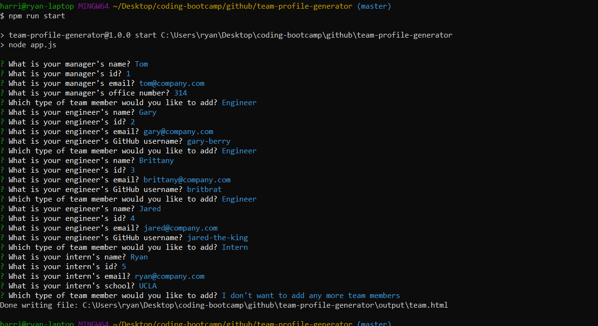

# Team Profile Generator

## Description

Team Profile Generator is a Node CLI application that dynamically generates an HTML webpage that displays summaries for each person on a software engineering team. The user will be prompted for information about the team manager and team members, which can be either engineers or interns.

## Table of Contents

- [Installation](#installation)
- [Usage](#usage)
- [Example Usage](#example-usage)
- [Contributing](#contributing)
- [Questions](#questions)

## Installation

To install the required dependencies, run the following command:

```
npm install
```

## Usage

To run the program, run the following command:

```
npm run start
```

## Example Usage

- Video example: https://www.youtube.com/watch?v=B2FXa1ln7qE
- Screenshot of App

  

## Contributing

If you want to contribute, feel free! Open a Pull Request and include a detailed description and screenshots of the changes.

## Questions

If you have any questions about the repo, open an issue or contact [ryan-harris](https://github.com/ryan-harris) directly at harris.ucla@gmail.com
